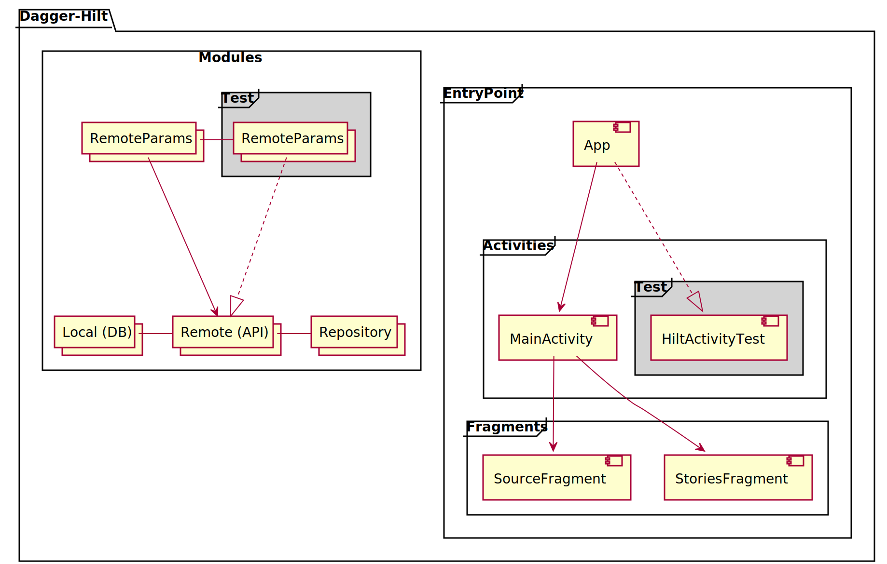

# Project Description
Show a list of images or videos in a carousel format

>App's functionalities:
>* It must respect the photo/video aspect ratio and orientation
>   * No auto switch
>   * Tap on right side of the screen to move to the next image/video
>   * Tap on the left side to move back
>   * Videos are going to play in loop
>   * User can pause videos tapping and holding the finger on the screen - and resume the playback when stop holding the finger
> * Write unit tests and/or UI tests

------------------------

<table>
<tr>
<td>
Save State handle - kill App on Background<br/>

</td>
</tr>
<tr>
<td>
Unit Test - Integration Test<br/>

</td>
</tr>
<tr>
<td>
Save State handle - kill App on Background<br/>

</td>
</tr>
</table>

------------------------

### MAIN FEATURES
- Kotlin
- Architectural Pattern MVVM
- Dependency Injection with Dagger-Hilt
- Navigation Component
- Flow and Mutable Live Data
- Data persistent with Room DB

### IMPLEMENTATIONS
- FragmentFactory
- ViewBinding
- SavedStateHandle
- NavigationSafeArgs
- NetworkBoundResource

### EXTRA FEATURES
- custom view _**"OverlayStandbyView"**_ with viewBinding delegation

### UNIT TEST AND INTEGRATION TEST
- Junit, Espresso
- MockWebServer
- Dagger-Hilt injection test
- Real and Fake http response test
- Espresso Suite test

------------------------
### _*FOLDER STRUCTURE*_

#### _Main - Java:_
```yaml
↳ base: app entry point and constants
↳ data: data source classes
  ↳ local: data classes to map the API responses
     ↳ model: data model classes and Data Access Object (DAO - Room)
  ↳ remote: classes and interfaces of API
     ↳ response: data classes to map the API responses and Data Transfer Object (DTO - Mapper)
↳ di: hilt dependency injection folder, (Local, Remote and Repository modules)
↳ repository: communication middle layer between data sources and viewmodels
↳ ui:
  ↳ _components: custom view, player and ui factories
↳ utils:
  ↳ extensions: kotlin extensions
```

#### _Debug - Java:_
```yaml
* HiltActivityTest: virtual activity to run Fragment scenario test with Dagger-Hilt
```

#### _androidTest - Java:_
Similar structure to the main directory, including only the directories with the classes to be tested
```yaml
* AppTestRunner: custom test instrumentation runner
* AppTestSuite: suite to run all integration test
↳ _components: required classes to run hilt and mockwebserver
```

------------------------

### Dependency Injection - Dagger-Hilt
- _**LocalModule**_: room database
- _**RemoteModule**_: retrofit and okHttp services \
  ↳ _**RemoteParamsModule**_: baseUrl separately to be overwritten in integration tests
- _**RepositoryModule**_: middle layer injection



------------------------

liviolopez@gmail.com